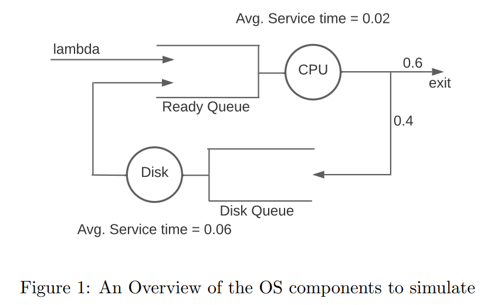

# CS4328: Project #1

## Overview



### Running the Simulator

The simulation can be executed directly from the command line by providing specific arguments related to the simulation's configuration. Here are the steps to run the simulator:

1. Open your terminal or command prompt.
2. Navigate to the directory where the simulation scripts are located.
3. Run the simulation using the following command format:

```bash
[...@eros Project1]$ python main.py <average_arrival_rate> <average_CPU_service_time> average_Disk_service_time>
```

### The Workload

Processes arrive at the CPU with an average arrival rate of λ (Lambda), following a Poisson distribution. If the CPU is idle, the process is processed immediately; otherwise, it joins the "Ready Queue". CPU service times are exponentially distributed, with an average service time of T_{s_{CPU}} . A process exits with a 60% probability after CPU processing or moves to the Disk with a 40% probability for further service. Disk service times are also exponentially distributed, with an average service time of  T_{s_{Disk}} . Processes are served in a First-Come-First-Served (FCFS) order. See Figure 1 for an overview of the system components.

#### Performance Metrics

We aim to compute the following metrics for each experiment:

- The average turnaround time for processes that completed
- The average throughput (number of processes completed per unit time)
- The average CPU utilization
- The average Disk utilization
- The average number of processes in the CPU Ready queue
- The average number of processes in the Disk Queue

## The Simulator

The simulator will generate processes with unique IDs and arrival times. Arrival rates follow a Poisson distribution, and service times follow an exponential distribution. We will vary λ to simulate different workloads. The simulation ends after 10000 processes are completed, and the specified metrics should be reported.

Events (e.g., process arrivals, completions) trigger state updates in the simulator, managed through a priority "Event Queue". The simulator's clock updates with each event. Three command-line arguments are required: average arrival rate λ, average CPU service time, and average Disk service time.

## The Runs

Vary the average arrival rate λ from 1 to 30 processes per second. For each λ value, plot the specified metrics.
